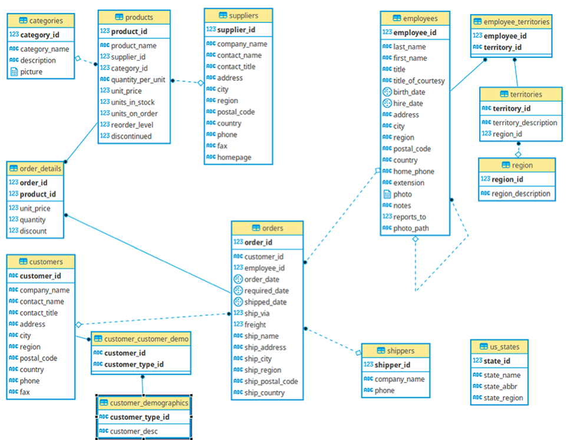
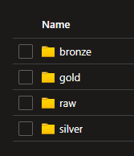

# 🏠 Azure Databricks Data Lakehouse

## 📋 About The Project

The objective of this project was to gain experience in implementing a Data Lakehouse on the Azure Databricks platform whilst following the medallion architecture (bronze > silver > gold), all contained within the unity catalog.

The intention of this project was to cover all aspects of a cloud Data Lakehouse implementation, including sourcing an appropriate dataset (Northwind SQL Server), ingestion with an automated batch ingestion tool (Azure Data Factory), cloud object storage in regimented processing layers (ADLS Gen 2), data transformation via Python and SQL code (Databricks notebooks and queries), and data visualisation of the processed data (Databricks dashboard).

As the discipline of data engineering grows in significance across all industries, so does the necessity to understand the underlying technical foundations.

The project was completed over 16 days using the Azure free 30-day trial that provides a total credit of 200 USD to use in that time. The total cost of the project was 43.73 AUD which was completely covered by the free credit.

## 🗺 Architecture Diagram

The diagram below illustrates the technologies used and how they operate together to take the data from source to consumption:

_Architecture Diagram_

## 💾 The Dataset

The dataset chosen for this analysis is the **<a href="https://github.com/microsoft/sql-server-samples/tree/master/samples/databases/northwind-pubs" target="_blank">Northwind dataset</a>** available from the **<a href="https://github.com/microsoft/sql-server-samples/tree/master" target="_blank">sql-server-samples</a>** repo, due to its simple and understandable schema, as well as its small size.

The repo contains a SQL Server script to create the database and all of its containing objects within a local environment. Here, the data is in its most raw form, ready for extraction and further processing in the cloud.

## 🔨 Extract, Load, Transform

The medallion architecture (bronze > silver > gold) follows the ELT paradigm, whereby data is first loaded into cloud storage in its raw form upon extraction, and then subsequent transformations are applied as it is moved throughout the various layers.

### ⛽ Extract

The data is extracted from the local SQL Server using Azure Data Factory (ADF). One single pipeline facilitates the movement of all the required tables from the SQL Server to the Azure Data Lake Storage (ADLS) Gen 2 _raw_ storage container in CSV format.

#### Fact Tables

The two fact tables (`orders` and `order_details`) are ingested using a loop that extracts one month of data at a time, to simulate a somewhat similar real-world scenario whereby data is ingested on a periodic basis (although often much more frequently than once a month). The pipeline contains two parameters, `start_date` and `end_date`, to specify the months for which to ingest the data for.

#### Dimension Tables

The rest of the dimension tables are ingested in their entirety and overwrite the existing files in the storage container upon each run.

### 🚚 Load

All of the data processed throughout the pipeline is stored in the `prod` storage container, which contains 4 directories:
1. raw
2. bronze
3. silver
4. gold

After the data is extracted from the local SQL Server, it is stored in the `raw` directory in CSV format.

### 🧪 Transform

The transformations are processed via the `Process Data` notebook which utilises the `Ingestor` notebook where the _Ingestor_ class is defined.

The basis of the ingestion process is built upon two configuration files:
1. config_tables.csv
2. config_fields.csv

Together, these configuration files define which tables and fields to ingest, the processing layers they belong to, their specified data types, and various other metadata.

The _Ingestor_ class loads these configuration files to the `silver` directory and creates tables in the `silver` schema that read from this external location. All of the subsequent processes that are run within the pipeline use the data in these configuration files to determine the logic when processing the data.

The processing of the data results in these source tables being loaded into both the bronze and silver layers, with differing levels of data-readiness with regards to BI reporting.

The two fact tables are processed using a batch streaming approach, whereby only the changes (delta) are captured between batches via a merge (UPSERT), whereas the dimension tables are processed using a full load approach, whereby the entire dataset is overwritten on each batch. In a real-world scenarion, the streaming batches would typically be run hourly or more often (depending on the business case) and the full loads would typically be run daily (unless required more often).

The streaming between `raw` and `bronze` is done using the `cloudFiles` approach in Databricks, whilst the streaming between `bronze` and `silver` is done using the `Change Data Feed (CDF)` approach, as the data is stored as delta tables.

## 📊 Data Visualisation

The data is finally visualised using the Databricks Dashboard feature, providing a basic understanding of the monthly freight volumes and revenues, by both the date the orders were placed and when they were delivered.

_Metrics displayed by **ordered date**_

_Metrics displayed by **shipped date**_